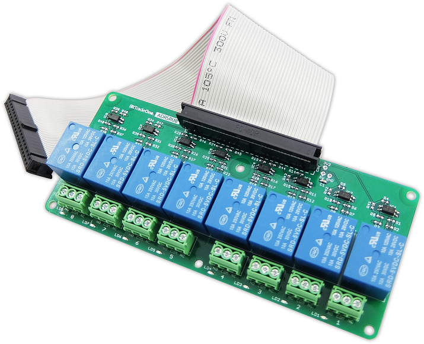
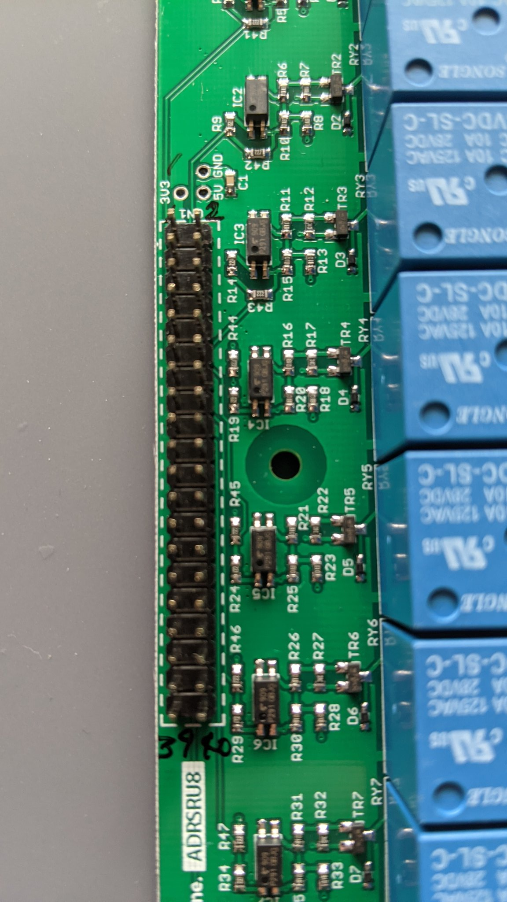

# 仕様




## 製品概要
Raspberry Pi の GPIO に接続することで高電圧高電流な機器をコントロールすることが可能となるリレー制御拡張基板の登場です。
リレーユニットには信頼の SRD-05VDC-SL-Cを採用し、GPIOからの給電のみで制御が可能。
リレーの作動状況を LED により視覚的に表示し、確認が容易となっています。
寸法はラズパイ 2 や 3 にぴったりフィットの HAT サイズ。手軽にお取扱い頂けます。
また、ご好評により8 回路版をラインナップに追加。
2 回路版や 4 回路版の特徴はそのままに、フォトカプラ による絶縁を施し多数の回路を取り扱っても安心の基盤となっています。
また、8 回路搭載 の大きな基板を取り回しやすくするため、40pin ケーブルを付属。手軽にお取扱い頂けます。ラズパイを用いて自宅の家電を”スマート家電”化するのに最適な拡張基板です。

 

## 高精度なリレーユニット。AC 250V/10A, DC30V/10A に対応。
リレーユニットには採用実績が多く、AC 250V/10A, DC30V/10A までの電圧/電流に対応する SRD-
05VDC-SL-C を使用。信頼性の高い部品で安心してご使用いただけます。

## 基板上のLED でリレー端子の状態を確認可能。
LED により視覚的に動作を把握可能。実験時の確認に役立ちます。

## リレー接続部は簡単に取り付けが可能な端子台を使用。
ドライバ一本で取り付け可能な端子台を使用、スムーズな製作を可能に。

 

## フォトカプラによる絶縁で、高電圧回路からの干渉を遮断。（8回路版のみ）
リレーで繋いだ高電圧回路からの干渉によるラズパイの破損を防ぐため、
フォトカプラにて絶縁対策済。

 

ADRSRUシリーズに搭載されているリレー群は以下のようにRaspberry PiのGPIOに結線されています。
GPIOの出力レベルLでNC側、出力レベルHでNO側に導通します。

|リレー番号|GPIO番号|ピン番号|搭載製品|
|:----|:----|:----|:----|
|1|4|7|2/4/8回路|
|2|17|11|2/4/8回路|
|3|27|13|4/8回路|
|4|22|15|4/8回路|
|5|18|12|8回路|
|6|23|16|8回路|
|7|24|18|8回路|
|8|25|22|8回路|


```
基本仕様 
型番：ADRSRU2 JAN: 4562469771670 Raspberry Pi 用リレー制御拡張基板 2 回
路 
・【対応機種】Raspberry Pi Model B+／Raspberry Pi 2 Model B／Raspberry Pi 3 Model 
B 
・【回路数】2 回路 
・【コンタクト定格電流】10A 
・【対応電圧/電流】AC 250V/10A, DC30V/10A 
・【出力端子】COM/NO/NC 
・【コイル電圧】DC5V （GPIO 端子より給電） 
・【基板寸法】W65*H56*D25mm 
・【重量】約35g 
・【付属品】保証書1 部 ネジセット 
・【使用温度】 0 ～ 40℃（結露なきこと） 
・【生産国】Made in Japan
型番：ADRSRU4 JAN: 4562469771687 Rhaspberry Pi 用リレー制御拡張基板 4 回
路 
・【対応機種】Raspberry Pi Model B+／Raspberry Pi 2 Model B／Raspberry Pi 3 Model 
B 
・【回路数】4 回路 
・【コンタクト定格電流】10A 
・【対応電圧/電流】AC 250V/10A, DC30V/10A 
・【出力端子】COM/NO/NC 
・【コイル電圧】DC5V （GPIO 端子より給電） 
・【基板寸法】W65*H56*D25mm 
・【重量】約55g 
・【付属品】保証書1部 ネジセット 
・【使用温度】 0 ～ 40℃（結露なきこと） 
・【生産国】Made in Japan

・【対応機種】Raspberry Pi Model B+／Raspberry Pi 2 Model B／Raspberry Pi 3 Model B
・【回路数】8 回路
・【コンタクト定格電流】10A
・【対応電圧/電流】AC 250V/10A, DC30V/10A
・【出力端子】COM/NO/NC
・【コイル電圧】DC5V （GPIO 端子より給電） 
・【基板寸法】W130*H56*D18mm
・【重量】約 100g
・【付属品】保証書1部 ネジセット 
・【使用温度】 0 ～ 40℃（結露なきこと）
・【生産国】Made in Japan 
```

# Pin Assign



# Pin Assign (Raspberry Pi)

```
 +-----+-----+---------+------+---+-Pi ZeroW-+---+------+---------+-----+-----+
 | BCM | wPi |   Name  | Mode | V | Physical | V | Mode | Name    | wPi | BCM |
 +-----+-----+---------+------+---+----++----+---+------+---------+-----+-----+
 |     |     |    3.3v |      |   |  1 || 2  |   |      | 5v      |     |     |
 |   2 |   8 |   SDA.1 |   IN | 1 |  3 || 4  |   |      | 5v      |     |     |
 |   3 |   9 |   SCL.1 |   IN | 1 |  5 || 6  |   |      | 0v      |     |     |
 |   4 |   7 | GPIO. 7 |   IN | 0 |  7 || 8  | 0 | IN   | TxD     | 15  | 14  |
 |     |     |      0v |      |   |  9 || 10 | 1 | IN   | RxD     | 16  | 15  |
 |  17 |   0 | GPIO. 0 |   IN | 0 | 11 || 12 | 0 | IN   | GPIO. 1 | 1   | 18  |
 |  27 |   2 | GPIO. 2 |   IN | 0 | 13 || 14 |   |      | 0v      |     |     |
 |  22 |   3 | GPIO. 3 |   IN | 0 | 15 || 16 | 0 | IN   | GPIO. 4 | 4   | 23  |
 |     |     |    3.3v |      |   | 17 || 18 | 0 | IN   | GPIO. 5 | 5   | 24  |
 |  10 |  12 |    MOSI |   IN | 0 | 19 || 20 |   |      | 0v      |     |     |
 |   9 |  13 |    MISO |   IN | 0 | 21 || 22 | 0 | IN   | GPIO. 6 | 6   | 25  |
 |  11 |  14 |    SCLK |   IN | 0 | 23 || 24 | 1 | IN   | CE0     | 10  | 8   |
 |     |     |      0v |      |   | 25 || 26 | 1 | IN   | CE1     | 11  | 7   |
 |   0 |  30 |   SDA.0 |   IN | 1 | 27 || 28 | 1 | IN   | SCL.0   | 31  | 1   |
 |   5 |  21 | GPIO.21 |   IN | 1 | 29 || 30 |   |      | 0v      |     |     |
 |   6 |  22 | GPIO.22 |   IN | 1 | 31 || 32 | 0 | IN   | GPIO.26 | 26  | 12  |
 |  13 |  23 | GPIO.23 |   IN | 0 | 33 || 34 |   |      | 0v      |     |     |
 |  19 |  24 | GPIO.24 |   IN | 0 | 35 || 36 | 0 | IN   | GPIO.27 | 27  | 16  |
 |  26 |  25 | GPIO.25 |   IN | 0 | 37 || 38 | 0 | IN   | GPIO.28 | 28  | 20  |
 |     |     |      0v |      |   | 39 || 40 | 0 | IN   | GPIO.29 | 29  | 21  |
 +-----+-----+---------+------+---+----++----+---+------+---------+-----+-----+
 | BCM | wPi |   Name  | Mode | V | Physical | V | Mode | Name    | wPi | BCM |
 +-----+-----+---------+------+---+-Pi ZeroW-+---+------+---------+-----+-----+
```